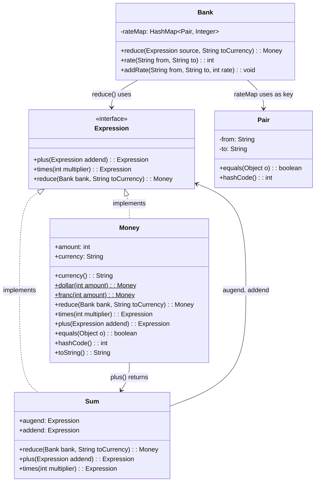

# Test Driven Development By Example

Examples provided have been inspired by Kent Beck's examples in his book [Test-Driven Development By Example](https://www.amazon.in/Test-Driven-Development-Kent-Beck/dp/8131715957/ref=sr_1_1?sr=8-1).

In this repository, we look at using Beck's classic TDD Money Example - updated to Java 11 and JUnit 5. 

## Setup

### Requirements

- Should use Java 11 or higher. Previous versions of Java are un-tested. 
- Use Maven 3.5.2 or higher.

## Class Diagram



## Functionality

Example of **Money Calculation System** that supports:

- Different currencies (USD, CHF, etc.)
- Addition of money (plus)
- Multiplication (times)
- Currency conversion via a bank

### High Level Idea

Instead of directly calculating everything, the system:

- Builds **expressions** like `5 USD + 10 CHF`
- Then asks a Bank to "reduce" (evaluate) it into a final currency

### Expression Interface (The Contract)

Any "money-like thing" must support:

- `plus()` -> addition
- `times()` -> multiplication
- `reduce()` -> convert into final `Money`

**Who implements it?**

- `Money`
- `Sum`

### Money Class (Represents actual money)

- Have Factory Method to create instances of different currencies like Dollar & Franc
- Stores value like `amount`, `currency`
- Multiplies money in `times` method
- Add money in `plus` method. BUT, it does NOT calculate immediately, it returns an `Expression`
- `Reduce` method which provides the final evaluated `Money` after applying the conversion rate given by `Bank`

### Sum Class (Represents Addition)

- This is the core of delayed calculation
- Convert both sides to target currency, add them up, and return the final `Money`

### Bank Class (Handles Conversion)

- This is the exchange rate manager + evaluator
- Stores the exchange rates in a HashMap

### Pair Class (Key for exchange rates)

- Used as `Key` in the exchange rate HashMap

### Full Flow Example

```java
Expression sum = Money.dollar(5).plus(Money.franc(10));

Bank bank = new Bank();
bank.addRate("CHF", "USD", 2);

Money result = bank.reduce(sum, "USD");
```

- Create Expression `5 USD + 10 CHF` (not calculated yet)
- Add the exchange rate
- Call `reduce`
  - Left: `5 USD -> 5 USD`
  - Right: `10 CHF -> 10 / 2 = 5 USD`
  - Add them up: `5 + 5 = 10 USD`
- Final Result: `Money(10, "USD")`
