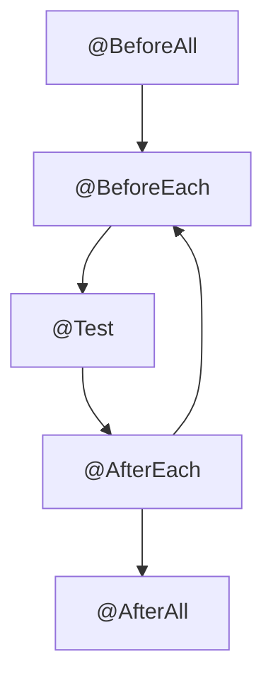

# Introduction to JUnit 5 with Maven

This source code repository contains JUnit 5 test examples with Maven.

## Setup

### Requirements

- Should use Java 11 or higher. Previous versions of Java are un-tested.
- Use Maven 3.5.2 or higher

## Junit 5 Modules

- **JUnit Platform** - The foundation for launching testing frameworks on the JVM. Allows tests to be run from a console Launcher, or build tools such as Maven and Gradle.
- **JUnit Jupiter** - Programming model for writing tests and extensions to JUnit.
- **JUnit Vintage** - Provides a test engine for running JUnit 3 and JUnit 4 tests.

## JUnit Annotations

| Annotation         | Description                                                 |
|--------------------|-------------------------------------------------------------|
| @Test              | Marks a method as a test method                             |
| @ParameterizedTest | Marks method as a parameterized test                        |
| @RepeatedTest      | Repeat test N times                                         |
| @TestFactory       | Test Factory method for dynamic tests                       |
| @TestInstance      | Used to configure test instance lifecycle                   |
| @TestTemplate      | Creates a template to be used by multiple test cases        |
| @DisplayName       | Human friendly name for test                                |
| @BeforeEach        | Method to run before each test case                         |
| @AfterEach         | Method to run after each test case                          |
| @BeforeAll         | Static method to run before all test cases in current class |
| @AfterAll          | Static method to run after all test cases in current class  |
| @Nested            | Creates a nested test class                                 |
| @Tag               | Declare 'tags' for filtering tests                          |
| @Disabled          | Disable test or class                                       |
| @ExtendWith        | Used to register extensions                                 |

## Junit Test Lifecycle



## Running JUnit 5 tests from command line with Maven

Bash script:

```shell
./mvnw clean test
```

For Windows:

```shell
./mvnw.cmd clean test
```

Here two goals are combined - `clean` and `test`.
